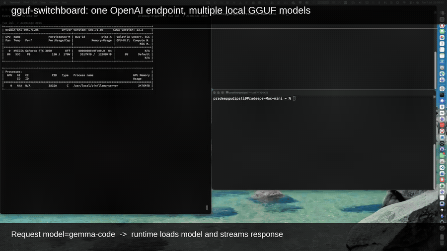
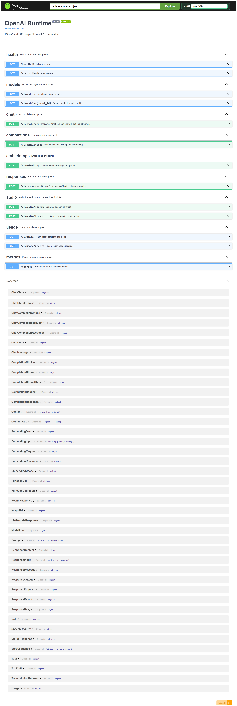

# gguf-switchboard



<sub>[▶ Watch with audio](gguf-switchboard-demo-linkedin.mp4)</sub>

A **100% OpenAI API-compatible** local inference runtime that dynamically loads and unloads GGUF models on demand. Point any OpenAI SDK or tool at it — Python, Node, Cursor, Cline, Continue — and it Just Works.

## Why

When running local LLMs, you typically manage models manually: start `llama-server` for one model, stop it, start another. If you use multiple models — a code model in Cursor, a general model in Continue, an embedding model for search — you're juggling processes, ports, and GPU memory yourself.

### Landscape comparison

Several tools address parts of this problem. None combine OpenAI compatibility, GGUF support, and GPU-aware model lifecycle management in one place.

| Tool | OpenAI API | Loads by model name | Auto unload/load | GGUF support | Worth using? |
|------|:----------:|:-------------------:|:----------------:|:------------:|--------------|
| **Ollama** | Yes | Yes | Partial — keeps models resident | Yes | Close, but limited GPU scheduling control |
| **llama.cpp** (`llama-server`) | Yes | Manual — one process per model | No — you manage start/stop | Yes | Low-level; you own process and port management |
| **llama-swap** | Yes | Yes | Yes — swaps on request; not VRAM-pressure aware | Yes | Single-binary, easy install; no idle timeout, VRAM monitoring, or usage tracking |
| **vLLM** | Yes | Yes | Yes — multi-model on large GPUs | No (HuggingFace weights) | Excellent for datacenter GPUs, not GGUF workflows |
| **LocalAI** | Yes | Yes | Partial — not VRAM-pressure aware | Yes | Closest alternative, but not designed for eviction under memory pressure |
| **Open WebUI** | Yes (proxy) | Via backend | Depends on backend | Via backend | UI layer — not a model scheduler |
| **LiteLLM** | Yes | Routes only | No — does not load models | Via providers | API router, not a model loader |
| **gguf-switchboard** | Yes | Yes | Yes — GPU-aware eviction | Yes | Built specifically for this problem |

### Why existing tools fall short

- **llama-swap** is the closest single-binary alternative — download, configure, run, done. It swaps llama-server processes on request. What it lacks: no VRAM pressure monitoring, no context-size fallback on OOM, no idle timeout / priority model, no usage tracking.
- **Ollama** gets close — drop-in model names, OpenAI-compatible API, GGUF support — but you have limited control over GPU scheduling. Models tend to stay resident; switching under VRAM pressure is opaque.
- **LocalAI** is a full-stack alternative supporting many backends and formats. It is not designed for proactive eviction when GPU memory is under pressure; you still manage capacity yourself.
- **LiteLLM** is an excellent API gateway for routing, fallbacks, and retries across cloud and local providers. It does not spawn backends, load GGUF weights, or manage GPU memory — that is not its job.

The gap: a tool that treats **model loading as a scheduling problem** on constrained local GPU hardware, not just an API compatibility layer.

### What makes this different

gguf-switchboard is a **GPU-aware model scheduler**. It presents a single OpenAI-compatible endpoint and decides which model should be loaded based on incoming requests and available VRAM — your tools never manage processes or ports.

```
OpenAI Request
     │
     ▼
Requested model?
     │
     ├─ Already loaded? ──Yes──▶ Forward to backend
     │
     └─ No ──▶ Stop current model ──▶ Load requested model ──▶ Wait for healthy ──▶ Forward
```

The result: one endpoint, many models, zero manual process management.

```
┌─────────────────────────────────────────────────────────────┐
│                      gguf-switchboard                        │
│                                                              │
│  /v1/chat/completions  ─┐                                    │
│  /v1/completions       ─┤                                    │
│  /v1/embeddings        ─┼──▶ Scheduler ──▶ Backend          │
│  /v1/responses         ─┤      (LRU)       (llama.cpp)      │
│  /v1/audio/*           ─┘                                    │
│                                                              │
│  Dynamic model loading: A→B→A without restart                │
│  Priority model auto-loads after configurable idle timeout   │
│  Prometheus metrics at /metrics                              │
└─────────────────────────────────────────────────────────────┘
```

### Separation of concerns

This project does one job well: **local GPU scheduling and model lifecycle**.

| Layer | Responsibility |
|-------|----------------|
| **[OmniRoute](https://github.com/diegosouzapw/OmniRoute)** / **[LiteLLM](https://www.litellm.ai/)** | Provider routing, fallbacks, retries across cloud and local endpoints |
| **gguf-switchboard** (this project) | Local GPU scheduling, process lifecycle, model loading/unloading |
| **Client tools** (Cursor, Cline, Codex, Open WebUI, etc.) | Talk to gguf-switchboard as a normal OpenAI server — no special integration needed |

Point your IDE or agent at `http://localhost:9090/v1`, set a model name from your config, and requests flow through the scheduler automatically.

### What you get

- **OpenAI-compatible API** — `/v1/chat/completions`, `/v1/completions`, `/v1/embeddings`, `/v1/responses`, `/v1/models`, `/v1/audio/*`
- **llama.cpp backend** — spawns and manages `llama-server` child processes
- **Automatic model loading/unloading** — models come up on first request, no manual restarts
- **LRU eviction** — unloads the least-recently-used model when capacity is reached
- **GPU VRAM awareness** — monitors memory pressure and evicts before OOM
- **Health checks with loaded model name** — `/health` and `/status` report which model is active
- **SSE streaming** — full `text/event-stream` support with proper `[DONE]` termination
- **Prometheus metrics** — request counts, latency histograms, model load times at `/metrics`
- **Idle timeout** — returns to your priority model after configurable inactivity
- **Priority model auto-load** — keeps your preferred model warm when the GPU is idle

## Features

- **Drop-in OpenAI API** — `/v1/chat/completions`, `/v1/completions`, `/v1/embeddings`, `/v1/responses`, `/v1/models`, `/v1/audio/*`
- **Dynamic model loading** — models are loaded/unloaded on demand; no restart needed
- **LRU eviction** — automatically unloads the least-recently-used model when capacity is reached
- **Priority model** — auto-loads your preferred model after a configurable idle timeout
- **SSE streaming** — full `text/event-stream` support with proper `[DONE]` termination
- **Prometheus metrics** — request counts, latency histograms, active request gauges
- **Graceful shutdown** — SIGTERM/SIGINT handling with backend cleanup
- **Production-ready** — structured JSON logging, request IDs, error responses matching OpenAI format

## Quick Start

### Download a prebuilt binary

Grab the latest binary from [GitHub Releases](https://github.com/pradeepgudipati/gguf-switchboard/releases/latest) — no Rust toolchain required:

```bash
# Linux x86_64
curl -fsSL https://github.com/pradeepgudipati/gguf-switchboard/releases/latest/download/gguf-switchboard-linux-amd64 \
  -o gguf-switchboard && chmod +x gguf-switchboard

# Linux ARM64
curl -fsSL https://github.com/pradeepgudipati/gguf-switchboard/releases/latest/download/gguf-switchboard-linux-arm64 \
  -o gguf-switchboard && chmod +x gguf-switchboard

# macOS Apple Silicon
curl -fsSL https://github.com/pradeepgudipati/gguf-switchboard/releases/latest/download/gguf-switchboard-darwin-arm64 \
  -o gguf-switchboard && chmod +x gguf-switchboard
```

Copy `config.toml` from this repo, point it at your `llama-server` binary and GGUF model paths, then run:

```bash
./gguf-switchboard config.toml
```

Explore the API at **http://localhost:9090/swagger-ui/**.

### Install as a systemd service

If you want the runtime to start on boot and restart on failure, `deploy.sh` handles everything:

```bash
./deploy.sh
```

The script installs build dependencies and Rust (if needed), builds the release binary, creates `/etc/gguf-switchboard/config.toml` from the template if missing, installs the systemd service, and starts the server on `0.0.0.0:9090`.

On completion it prints a table of **available models** (ID, display name, priority/loaded state) plus links to Swagger UI and health endpoints.

**Post-install:** Edit `/etc/gguf-switchboard/config.toml` to point at your `llama-server` binary and GGUF model paths, then re-run:

```bash
./deploy.sh
```

Or restart only:

```bash
sudo systemctl restart gguf-switchboard
```

### Fresh machine (no clone yet)

```bash
curl -fsSL https://raw.githubusercontent.com/pradeepgudipati/gguf-switchboard/Dev/deploy.sh | bash
```

### Prerequisites

- Ubuntu/Debian (for `apt`; other distros: install equivalent build deps manually)
- [llama.cpp](https://github.com/ggerganov/llama.cpp) built with server support
- A GGUF model file (configure paths in config after install)

Rust is installed automatically if missing.

## Architecture

```
Client Request
     │
     ▼
┌──────────┐    ┌───────────────┐    ┌──────────────┐
│  Axum    │───▶│   Scheduler   │───▶│   Backend    │
│  Router  │    │               │    │  (llama.cpp) │
│          │    │ • LRU queue   │    │              │
│ /v1/...  │    │ • Load lock   │    │ • child proc │
│ /health  │    │ • Priority    │    │ • health ck  │
│ /metrics │    │   watcher     │    │ • HTTP proxy │
└──────────┘    └───────────────┘    └──────────────┘
```

**Scheduler** is the core component:
1. Request arrives for model `X`
2. If `X` is loaded → forward immediately
3. If model `Y` is loaded → unload `Y` → load `X` → wait for health → forward
4. After `idle_timeout` seconds with no requests, the priority model auto-loads

**Backend** (llama.cpp implementation):
- Spawns `llama-server` as a child process using the configured `command` + `args`
- Polls the health endpoint until healthy or timeout
- Proxies all OpenAI-compatible HTTP requests to the backend URL
- Parses SSE streams and re-emits them with proper framing

## Configuration

Configuration is a TOML file (default: `config.toml`):

```toml
bind = "0.0.0.0:9090"        # Address to listen on
startup_timeout = 60           # Max seconds to wait for model health
idle_timeout = 600             # Seconds before priority model auto-loads
default_backend = "llama.cpp"  # Default backend engine

[models.local-gemma-code]
backend = "llama.cpp"
display_name = "Gemma 3 Coding Model"
command = "/usr/local/bin/llama-server"
args = [
    "-m", "/models/gemma-3-4b.gguf",
    "--host", "127.0.0.1",
    "--port", "8081",
    "-c", "65536",
    "-ngl", "999",
]
backend_url = "http://127.0.0.1:8081/v1"
health_url = "http://127.0.0.1:8081/health"
priority = true                # Auto-load after idle timeout

[models.local-qwen-coder]
backend = "llama.cpp"
display_name = "Qwen 2.5 Coder"
command = "/usr/local/bin/llama-server"
args = [
    "-m", "/models/qwen2.5-coder-7b.gguf",
    "--host", "127.0.0.1",
    "--port", "8082",
    "-c", "65536",
    "-ngl", "999",
]
backend_url = "http://127.0.0.1:8082/v1"
health_url = "http://127.0.0.1:8082/health"
priority = false
```

### Fields

| Field | Description |
|-------|-------------|
| `bind` | Socket address for the HTTP server |
| `startup_timeout` | Seconds to wait for a backend to become healthy |
| `idle_timeout` | Seconds of inactivity before the priority model loads |
| `default_backend` | Fallback backend engine name |
| `models.<id>.backend` | Engine type (`llama.cpp`) |
| `models.<id>.display_name` | Human-readable name shown in `/v1/models` |
| `models.<id>.command` | Path to the backend binary |
| `models.<id>.args` | Command-line arguments (model path, port, context size, etc.) |
| `models.<id>.backend_url` | Base URL for the backend's OpenAI-compatible API |
| `models.<id>.health_url` | Health check endpoint URL |
| `models.<id>.priority` | If `true`, auto-loads after `idle_timeout` |
| `memory_warning_threshold` | RAM usage % that logs a warning |
| `memory_critical_threshold` | RAM usage % that auto-unloads the active model |
| `memory_check_interval_secs` | Seconds between RAM pressure checks |
| `context_fallback_min` | Lowest `-c` value used when auto-reducing context after a failed load |

### Context size (`-c`)

All models in the bundled configs default to a **65536-token** context window via the `-c` flag passed to `llama-server`:

```toml
args = [
    # ...
    "-c", "65536",
    # ...
]
```

This is the effective context limit for clients (Cursor, Cline, Continue, etc.) — not whatever context size the IDE UI may advertise.

**After changing `-c`**, restart the runtime (or trigger a model reload) so `llama-server` picks up the new value:

```bash
sudo systemctl restart gguf-switchboard
# or
./deploy.sh
```

**VRAM tradeoff:** larger context uses more GPU memory. On constrained GPUs (e.g. 12 GB), you may need to lower `-c` per model if loads fail or you hit OOM — especially for larger quantised models.

**Automatic fallback:** if a model fails to start or never becomes healthy (for example due to insufficient VRAM for a large `-c`), the runtime halves the context size and retries until it succeeds or reaches `context_fallback_min` (default `8192`). The reduced value applies for the rest of the process lifetime (it is not written back to `config.toml`).

```toml
context_fallback_min = 8192
```

## Running Locally

```bash
# With cargo
cargo run --release -- config.toml

# With environment-based log level
RUST_LOG=debug cargo run --release -- config.toml

# With custom port
# (edit config.toml bind = "0.0.0.0:3000")
```

### Pre-commit checks

Install git hooks to run standard Rust checks before each commit (format, clippy with denied warnings, build, tests):

```bash
./scripts/install-hooks.sh
```

Run the same checks manually:

```bash
./precommit.sh
```

## Systemd Setup (Recommended)

The native install is recommended because the runtime spawns `llama-server` as a child process and needs direct access to your GPU and model files.

```bash
./deploy.sh
```

Edit `/etc/gguf-switchboard/config.toml` to match your `llama-server` path and GGUF models, then re-run `./deploy.sh` or restart:

```bash
./deploy.sh
# or
sudo systemctl restart gguf-switchboard
```

```bash
# Check status
sudo systemctl status gguf-switchboard
sudo journalctl -u gguf-switchboard -f
```

### How It Works

```
Client Request
     │
     ▼
┌──────────────────────────────────────────────────┐
│             gguf-switchboard (:9090)              │
│                                                   │
│  1. Request arrives for model "X"                 │
│  2. If model "Y" loaded → SIGTERM "Y"             │
│  3. Spawn llama-server for "X" → wait for health  │
│  4. Proxy request → return response               │
│  5. After idle_timeout → load priority model      │
└───────────────────────┬──────────────────────────┘
                        │
                        ▼
              ┌──────────────────┐
              │   llama-server   │
              │   (GPU loaded)   │
              │   One at a time  │
              └──────────────────┘
```

## API Examples

### Chat Completions

```bash
curl http://localhost:9090/v1/chat/completions \
    -H "Content-Type: application/json" \
    -d '{
        "model": "local-gemma-code",
        "messages": [
            {"role": "system", "content": "You are a helpful coding assistant."},
            {"role": "user", "content": "Write a binary search in Rust."}
        ],
        "temperature": 0.7,
        "max_tokens": 1024
    }'
```

### Thinking models

`gemma-4-e4b` and `qwen3.5-9b` are thinking models served by llama.cpp with **reasoning enabled**. They emit chain-of-thought in a `reasoning_content` field on assistant messages (and stream deltas). The final answer is in `content` when the model finishes; if `max_tokens` is too low, reasoning may consume the budget and `content` can be empty — the runtime promotes `reasoning_content` into `content` in that case but keeps both fields when present.

Use **`max_tokens` 2048 or higher** for substantive questions so the model has room to think and answer. Short prompts with `max_tokens: 50` often return only thinking traces.

```bash
curl http://localhost:9090/v1/chat/completions \
    -H "Content-Type: application/json" \
    -d '{
        "model": "gemma-4-e4b",
        "messages": [
            {"role": "user", "content": "Is Rust faster than Python for backend services?"}
        ],
        "max_tokens": 2048,
        "stream": false
    }'
```

Optional: pass template kwargs through to llama-server (model-specific), e.g. `chat_template_kwargs` in the request body when your client supports it.

### Streaming Chat

```bash
curl http://localhost:9090/v1/chat/completions \
    -H "Content-Type: application/json" \
    -d '{
        "model": "local-gemma-code",
        "messages": [
            {"role": "user", "content": "Explain ownership in Rust."}
        ],
        "stream": true
    }'
```

### Text Completions

```bash
curl http://localhost:9090/v1/completions \
    -H "Content-Type: application/json" \
    -d '{
        "model": "local-gemma-code",
        "prompt": "fn fibonacci(n: u64) -> u64 {",
        "max_tokens": 256,
        "temperature": 0.2
    }'
```

### Embeddings

```bash
curl http://localhost:9090/v1/embeddings \
    -H "Content-Type: application/json" \
    -d '{
        "model": "local-gemma-code",
        "input": "The quick brown fox jumps over the lazy dog."
    }'
```

### List Models

After deploy, `./deploy.sh` prints configured models in the terminal. You can also query the API:

```bash
curl http://localhost:9090/v1/models
```

### Responses API

```bash
curl http://localhost:9090/v1/responses \
    -H "Content-Type: application/json" \
    -d '{
        "model": "local-gemma-code",
        "input": "What is the capital of France?",
        "instructions": "Answer concisely."
    }'
```

### API Explorer (Swagger UI)

After starting the runtime, open the interactive API docs in your browser:

- **Swagger UI:** http://localhost:9090/swagger-ui/
- **OpenAPI spec:** http://localhost:9090/api-docs/openapi.json
- **Root redirect:** http://localhost:9090/ → Swagger UI



All endpoints are listed and testable from the Swagger UI — health, models, chat completions, embeddings, usage, and more.

A **Model** dropdown appears in the top bar (like the Authorize button). The selected model is persisted in the browser and applied automatically to every API request that accepts a `model` field — chat, completions, embeddings, responses, audio, usage filters, and model lookups.

### Health & Status

```bash
# Liveness probe
curl http://localhost:9090/health

# Detailed status
curl http://localhost:9090/status

# Prometheus metrics
curl http://localhost:9090/metrics
```

## SDK Examples

### Python (openai)

```python
from openai import OpenAI

client = OpenAI(
    base_url="http://localhost:9090/v1",
    api_key="not-needed",  # any string works
)

# Chat completion
response = client.chat.completions.create(
    model="local-gemma-code",
    messages=[
        {"role": "system", "content": "You are a helpful assistant."},
        {"role": "user", "content": "Hello!"}
    ],
    temperature=0.7,
)
print(response.choices[0].message.content)

# Streaming
stream = client.chat.completions.create(
    model="local-gemma-code",
    messages=[{"role": "user", "content": "Tell me a story."}],
    stream=True,
)
for chunk in stream:
    if chunk.choices[0].delta.content:
        print(chunk.choices[0].delta.content, end="")
print()
```

### Node.js (openai)

```javascript
import OpenAI from "openai";

const client = new OpenAI({
    baseURL: "http://localhost:9090/v1",
    apiKey: "not-needed",
});

// Chat completion
const response = await client.chat.completions.create({
    model: "local-gemma-code",
    messages: [
        { role: "system", content: "You are a helpful assistant." },
        { role: "user", content: "Hello!" },
    ],
});
console.log(response.choices[0].message.content);

// Streaming
const stream = await client.chat.completions.create({
    model: "local-gemma-code",
    messages: [{ role: "user", content: "Tell me a story." }],
    stream: true,
});
for await (const chunk of stream) {
    process.stdout.write(chunk.choices[0]?.delta?.content ?? "");
}
console.log();
```

## IDE Integration

### Cursor

In Cursor settings, add a custom OpenAI-compatible model:

1. Open **Settings** → **Models** → **Add Model**
2. Set **API Base URL** to `http://localhost:9090/v1`
3. Set **API Key** to any string (e.g., `sk-local`)
4. Set **Model Name** to your model id (e.g., `local-gemma-code`)

### Cline (VS Code)

In Cline settings:

1. Select **OpenAI Compatible** as the API provider
2. Set **Base URL** to `http://localhost:9090/v1` (must include `/v1`)
3. Set **API Key** to any non-empty string (e.g., `sk-local`) — the runtime does not validate keys, but Cline requires the field
4. Set **Model** to your model id (must match `config.toml`, e.g., `gemma-4-e4b`)

If **"Use different models for Plan and Act modes"** is enabled, configure both modes separately (API key and base URL in each).

**Context errors:** Cline agent prompts can be large (30k+ tokens). If you see `exceed_context_size_error`, either start a fresh Cline task to reduce prompt size, or increase `-c` in `config.toml` and restart the runtime (see [Context size](#context-size-c) above).

### Continue (VS Code / JetBrains)

In `~/.continue/config.json`:

```json
{
    "models": [
        {
            "title": "Local Gemma Code",
            "provider": "openai",
            "model": "local-gemma-code",
            "apiBase": "http://localhost:9090/v1",
            "apiKey": "not-needed"
        }
    ]
}
```

## Monitoring

### Prometheus Metrics

| Metric | Type | Description |
|--------|------|-------------|
| `gguf_switchboard_requests_total` | Counter | Total HTTP requests |
| `gguf_switchboard_inference_latency_seconds` | Histogram | End-to-end inference latency |
| `gguf_switchboard_model_load_latency_seconds` | Histogram | Model cold-start time |
| `gguf_switchboard_active_requests` | Gauge | Current in-flight requests |
| `gguf_switchboard_loaded_model` | Gauge | Whether a model is loaded (0/1) |
| `gguf_switchboard_backend_healthy` | Gauge | Backend health status (0/1) |
| `gguf_switchboard_streaming_requests` | Gauge | Active streaming connections |

### Structured Logging

Logs are emitted as JSON to stdout:

```json
{
    "timestamp": "2025-01-15T10:30:00.000Z",
    "level": "INFO",
    "message": "Model loaded and healthy",
    "model": "local-gemma-code",
    "elapsed_ms": 3420,
    "request_id": "abc-123"
}
```

Set `RUST_LOG` to control verbosity:

```bash
RUST_LOG=info          # Default
RUST_LOG=debug         # Verbose
RUST_LOG=gguf_switchboard=debug,tower_http=info  # Per-crate
```

## Benchmarks

### Throughput Test

```bash
# Install hey: go install github.com/rakyll/hey@latest

# Non-streaming throughput
hey -n 100 -c 4 \
    -m POST \
    -H "Content-Type: application/json" \
    -d '{"model":"local-gemma-code","messages":[{"role":"user","content":"Say hello"}],"max_tokens":50}' \
    http://localhost:9090/v1/chat/completions

# Streaming throughput
hey -n 50 -c 2 \
    -m POST \
    -H "Content-Type: application/json" \
    -d '{"model":"local-gemma-code","messages":[{"role":"user","content":"Count to 10"}],"stream":true,"max_tokens":100}' \
    http://localhost:9090/v1/chat/completions
```

### Model Switching Latency

```bash
# Time a cold model switch
time curl -s http://localhost:9090/v1/chat/completions \
    -H "Content-Type: application/json" \
    -d '{"model":"local-qwen-coder","messages":[{"role":"user","content":"Hi"}],"max_tokens":10}' \
    > /dev/null
```

### vs llama-swap

Both gguf-switchboard and [llama-swap](https://github.com/mostlygeek/llama-swap) are thin proxies in front of `llama-server` — neither one runs inference itself, so token-generation speed is identical between them by construction. The only thing worth measuring is the proxy layer: request overhead, model-swap latency, memory footprint, and behavior under concurrent load. That's where Rust (no GC, no runtime scheduler) vs Go (concurrent GC, goroutine scheduler) could plausibly show a difference — most likely in idle/under-load memory footprint and tail latency (p95/p99) under concurrency, less likely in average-case latency, since both are I/O-bound waiting on the same `llama-server` child process either way.

[`scripts/bench-vs-llama-swap.sh`](scripts/bench-vs-llama-swap.sh) runs both tools back-to-back against the same `llama-server` binary and the same model(s), and reports:

- Request latency (avg/p50/p95/p99) on a warm model
- Model-swap latency (A→B→A round trips)
- Proxy process RSS, idle and under load
- Throughput under concurrent load (via [`hey`](https://github.com/rakyll/hey) if installed)

```bash
LLAMA_SERVER_BIN=/usr/local/bin/llama-server \
MODEL_A_PATH=/models/model-a.gguf \
MODEL_B_PATH=/models/model-b.gguf \
./scripts/bench-vs-llama-swap.sh
```

It builds `gguf-switchboard` if needed and downloads a `llama-swap` release binary automatically if one isn't found. Results land in `.bench/results-<timestamp>/report.md`. No numbers are published here — they depend entirely on your GPU, CPU, and models, so run it on your own hardware.

## Project Structure

```
.
├── Cargo.toml              # Dependencies and build config
├── config.toml             # Example configuration
├── gguf-switchboard.service  # Systemd unit file
├── .github/workflows/
│   ├── ci.yml              # CI: check, clippy, build, test
│   └── release.yml         # Multi-platform release builds
└── src/
    ├── main.rs             # Entry point, signal handling
    ├── config/mod.rs       # TOML configuration loading
    ├── errors/mod.rs       # OpenAI-compatible error responses
    ├── types/              # Request/response type definitions
    │   ├── mod.rs          # Shared types (ModelInfo, Usage, etc.)
    │   ├── chat.rs         # Chat completion types
    │   ├── completions.rs  # Text completion types
    │   ├── embeddings.rs   # Embedding types
    │   ├── models.rs       # Model permission types
    │   └── responses.rs    # Responses API types
    ├── backend/
    │   ├── mod.rs          # Backend trait definition
    │   └── llama_cpp.rs    # llama.cpp backend implementation
    ├── scheduler/mod.rs    # Core scheduler with LRU + priority
    ├── state/mod.rs        # Shared application state
    ├── memory/mod.rs       # System memory pressure monitoring
    ├── db/mod.rs           # Token usage tracking (SQLite)
    ├── proxy/mod.rs        # SSE proxy helpers
    ├── metrics/mod.rs      # Prometheus metric collectors
    └── api/
        ├── mod.rs          # Router setup
        ├── chat.rs         # POST /v1/chat/completions
        ├── completions.rs  # POST /v1/completions
        ├── embeddings.rs   # POST /v1/embeddings
        ├── models.rs       # GET /v1/models
        ├── responses.rs    # POST /v1/responses
        ├── audio.rs        # POST /v1/audio/*
        ├── health.rs       # GET /health, /status
        ├── metrics.rs      # GET /metrics
        └── usage.rs        # GET /v1/usage
```

## License

MIT
