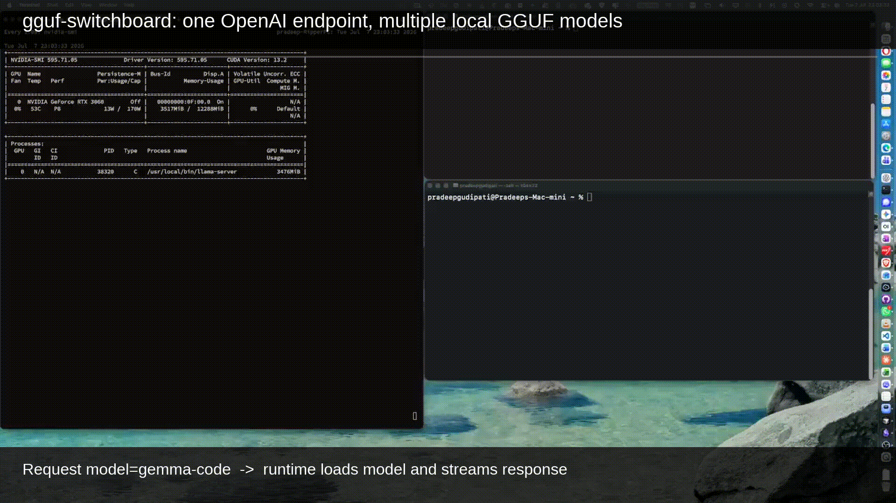
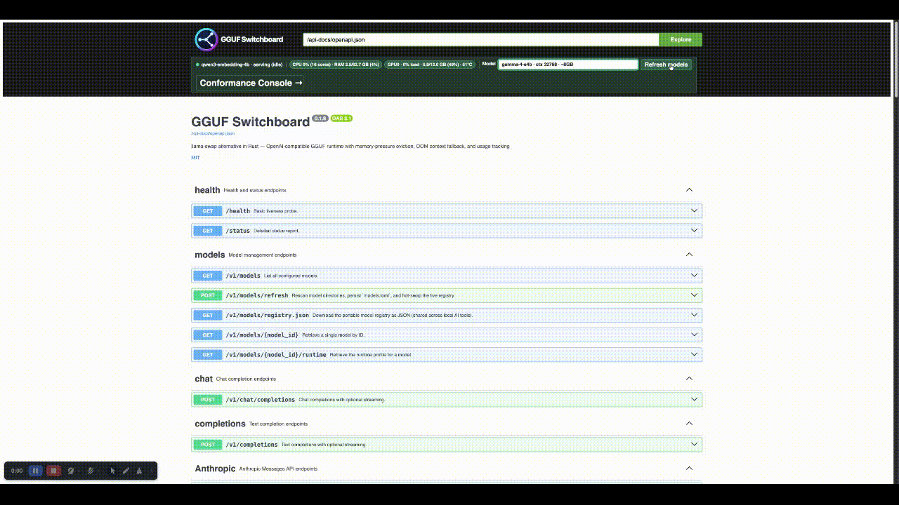
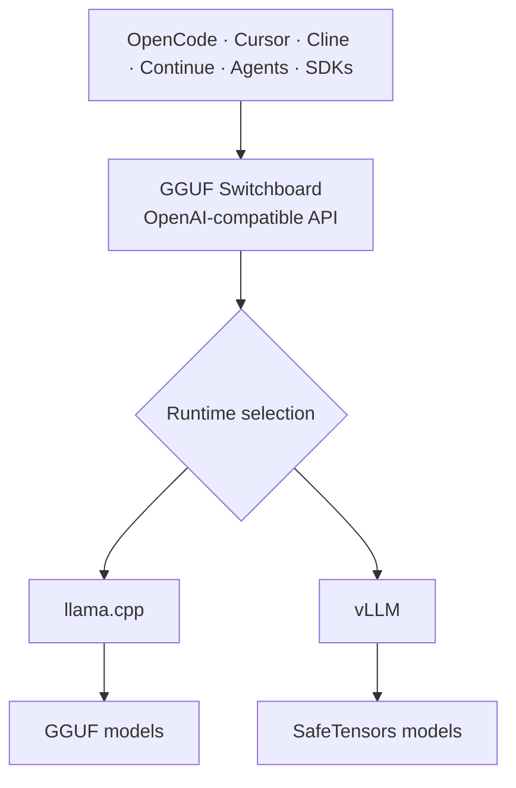
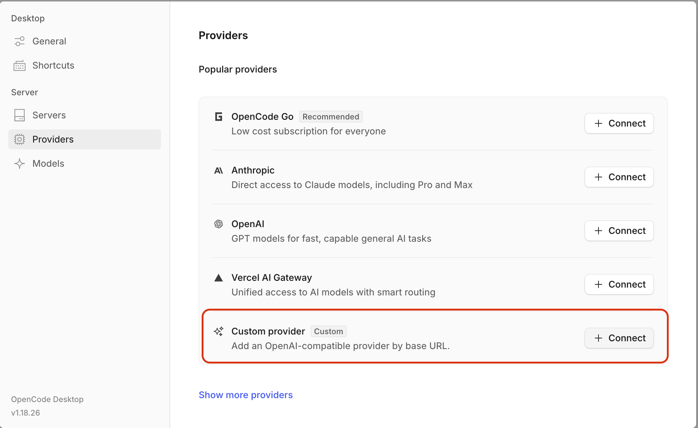
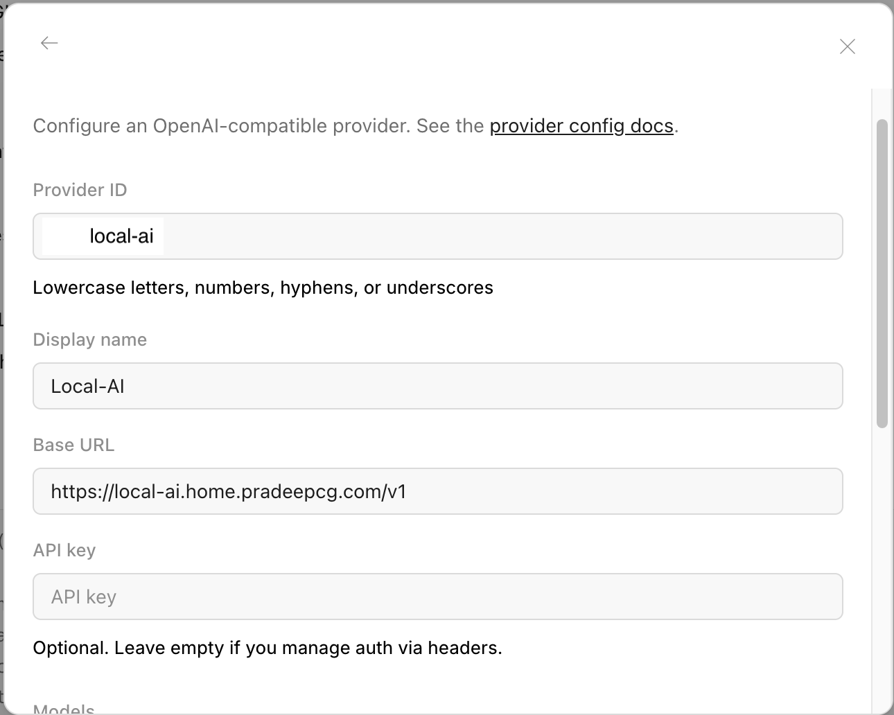
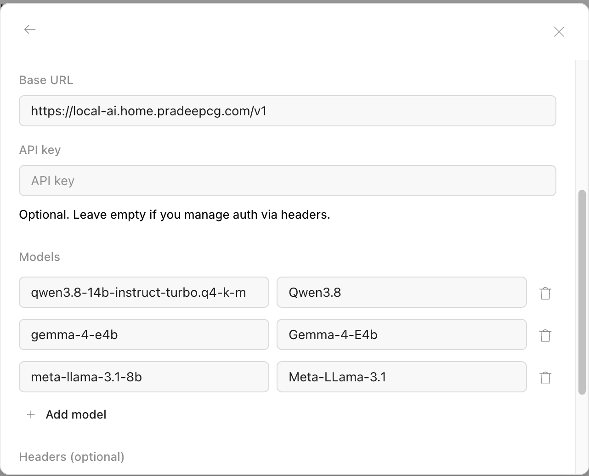
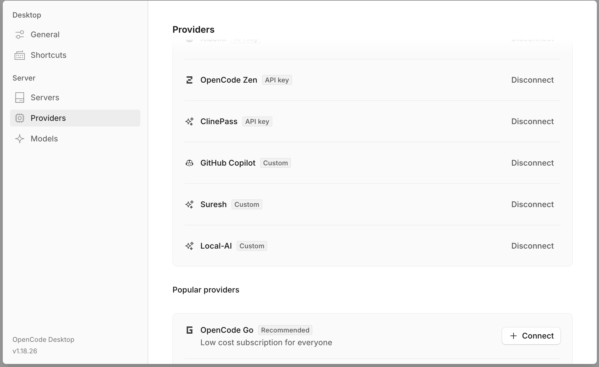

# GGUF Switchboard


[](https://github.com/pradeepgudipati/gguf-switchboard/actions/workflows/ci.yml)
[](LICENSE)
[](https://github.com/pradeepgudipati/gguf-switchboard/releases)
[](https://github.com/pradeepgudipati/gguf-switchboard)

**One machine. Many local models. One API.**

GGUF via llama.cpp, SafeTensors via vLLM.

## Why this matters

Local AI workflows increasingly depend on coding, reasoning, embedding, vision, and task-specific models. Some work best as GGUF through llama.cpp; others ship as SafeTensors and run through vLLM. Operating each runtime, port, and model lifecycle separately pushes orchestration into every client.

GGUF Switchboard gives those models one OpenAI-compatible endpoint. Name the model you want, and the switchboard selects the backend, drains in-flight work, switches models, rolls back failed loads, and plans against available VRAM.

## See it in action

The previews play automatically. Select either one to open the full MP4 demo.

| GGUF Switchboard demo | API console demo |
|---|---|
| [](docs/assets/demo.mp4) | [](docs/assets/GGUF-Switchboard-—-API-console.mp4) |

## Architecture


```mermaid
flowchart TB
    Clients["OpenCode · Cursor · Cline · Continue · Agents · SDKs"]
    Switchboard["GGUF Switchboard<br/>OpenAI-compatible API"]
    Selector{"Runtime selection"}
    Llama["llama.cpp"]
    VLLM["vLLM"]
    GGUF["GGUF models"]
    SafeTensors["SafeTensors models"]

    Clients --> Switchboard
    Switchboard --> Selector
    Selector --> Llama
    Selector --> VLLM
    Llama --> GGUF
    VLLM --> SafeTensors
```

## What makes this different

1. **One API across model formats and runtimes:** GGUF through llama.cpp and Hugging Face SafeTensors through vLLM, exposed through the same OpenAI-compatible endpoint.
2. **Request-driven model switching:** The requested model controls backend selection, with in-flight draining, failed-switch rollback, and idle priority warm-up.
3. **VRAM-aware operation:** Hardware-aware fit planning, bounded OOM fallback, automatic GPU-layer selection, and memory-pressure eviction help a model fleet share one machine.
4. **Hardware-aware Hugging Face search:** `ggs models search` scores available quantizations against detected hardware for fit, speed, balance, and precision.
5. **Broad client compatibility:** Chat Completions, Completions, Embeddings, Responses, Rerank, Audio, and Anthropic Messages support coding tools, agents, and OpenAI-compatible SDKs.

## Quick Start

**Install** (Linux with NVIDIA/CUDA):

```bash
git clone --branch main https://github.com/pradeepgudipati/gguf-switchboard.git
cd gguf-switchboard
./deploy.sh
```

**Pull a model** from Hugging Face:

```bash
# GGUF served by llama.cpp
gguf-switchboard models pull lmstudio-community/Qwen3.5-9B-GGUF --quant Q4_K_M --dir /var/lib/gguf-switchboard/models --registry /opt/gguf-switchboard/models.toml

# SafeTensors served by vLLM
gguf-switchboard models pull vllm Qwen/Qwen2.5-7B-Instruct --dir /var/lib/gguf-switchboard/vllm-models --registry /opt/gguf-switchboard/models.toml
```

**Send a request** through the same endpoint regardless of backend:

```bash
curl -s http://localhost:9090/v1/models | jq -r '.data[].id'

curl http://localhost:9090/v1/chat/completions \
  -H "Content-Type: application/json" \
  -d '{"model":"qwen3.5-9b","messages":[{"role":"user","content":"Hello"}]}'
```

Name the model you want. GGUF Switchboard selects its registered backend, unloads the resident model when necessary, starts the requested model, and forwards the request through the same API.

**Platform guides:** [Linux](docs/deployment/linux.md) · [macOS](docs/deployment/macos.md) · [Windows (WSL2)](docs/deployment/windows.md)

## Supported Clients

| Client | Configuration Guide |
|--------|---------------------|
| **OpenCode** | [docs/integrations/opencode.md](docs/integrations/opencode.md) |
| **Cursor** | [docs/integrations/cursor.md](docs/integrations/cursor.md) |
| **Cline** | [docs/integrations/cline.md](docs/integrations/cline.md) |
| **Continue** | [docs/integrations/continue.md](docs/integrations/continue.md) |
| **OpenAI SDK** | [docs/integrations/openai-sdk.md](docs/integrations/openai-sdk.md) |
| **Any OpenAI-compatible client** | Use `http://localhost:9090/v1` as base URL |

<details>
<summary><strong>OpenCode Desktop setup walkthrough</strong></summary>

Select **Custom provider**, configure the GGUF Switchboard base URL, add the model aliases exposed by `/v1/models`, and connect.

| 1. Select Custom provider | 2. Configure the endpoint |
|---|---|
|  |  |

| 3. Add model aliases | 4. Confirm the connected provider |
|---|---|
|  |  |

See the complete [OpenCode integration guide](docs/integrations/opencode.md).

</details>

## Model Search

Find models that actually fit your hardware:

```bash
# Search GGUF models
ggs models search "Qwen 7B"

# Search SafeTensors/vLLM models
ggs models search vllm "Qwen3.5-9B-AWQ"
```

Example output:

```
REPO                                               | BACKEND  |     SIZE | FIT | QUANT       | SPEED
bartowski/Qwen3.5-9B-GGUF                          | llama.cpp|  6.2 GB  | 100 | Q4_K_M      | ~127 tok/s
Qwen/Qwen2.5-7B-Instruct-AWQ                       | vLLM     |  8.4 GB  | 100 | AWQ         | fast
```

See [docs/models/model-search.md](docs/models/model-search.md) for details.

## Documentation

### Getting Started

| Doc | Contents |
|-----|----------|
| **[Quick Start](docs/getting-started/quick-start.md)** | 5-minute path from install to first inference |
| **[Installation](docs/getting-started/installation.md)** | Platform-specific installation guides |
| **[Configuration](docs/getting-started/configuration.md)** | `config.toml`, `models.toml`, `[fit]` section, discovery, context sizing, CLI |

### Models

| Doc | Contents |
|-----|----------|
| **[Model Search](docs/models/model-search.md)** | Hardware-aware Hugging Face search |
| **[GGUF Models](docs/models/gguf.md)** | GGUF format, quantizations, pulling models |
| **[SafeTensors Models](docs/models/safetensors.md)** | SafeTensors format, vLLM support, AWQ/GPTQ |

### Runtimes

| Doc | Contents |
|-----|----------|
| **[Runtime Overview](docs/runtimes/overview.md)** | llama.cpp and vLLM backend selection |
| **[llama.cpp Runtime](docs/runtimes/llama-cpp.md)** | GGUF execution via llama.cpp |
| **[vLLM Runtime](docs/runtimes/vllm.md)** | SafeTensors execution via vLLM |
| **[Model Switching](docs/runtimes/model-switching.md)** | Single-slot swapping, drain, rollback |
| **[VRAM Management](docs/runtimes/vram-management.md)** | Hardware-aware fit planning, OOM fallback |

### Integrations

| Doc | Contents |
|-----|----------|
| **[OpenCode](docs/integrations/opencode.md)** | OpenCode provider configuration |
| **[Cursor](docs/integrations/cursor.md)** | Custom OpenAI-compatible model setup |
| **[Cline](docs/integrations/cline.md)** | VS Code Cline provider configuration |
| **[Continue](docs/integrations/continue.md)** | VS Code / JetBrains Continue configuration |
| **[OpenAI SDK](docs/integrations/openai-sdk.md)** | Python, Node.js, curl examples |

### API & Architecture

| Doc | Contents |
|-----|----------|
| **[OpenAI API](docs/api/openai-api.md)** | Chat, Completions, Embeddings, Responses, Audio examples |
| **[Anthropic API](docs/api/anthropic-api.md)** | Anthropic Messages API translation |
| **[Architecture](docs/architecture/overview.md)** | Scheduler, backends, ModelFitPlanner, project layout |
| **[Backend Selection](docs/architecture/backend-selection.md)** | GGUF vs SafeTensors routing logic |

### Reference

| Doc | Contents |
|-----|----------|
| **[Compatibility](docs/COMPATIBILITY.md)** | OpenAI + Anthropic endpoint coverage, feature matrix |
| **[Comparison](docs/COMPARISON.md)** | Landscape vs Ollama / llama-swap / others |
| **[Benchmarks](docs/BENCHMARKS.md)** | Throughput, swap latency, bench script |
| **[Conformance Console](docs/CONFORMANCE-CONSOLE.md)** | Tool-calling diagnostics |
| **[Quant Scoring](docs/QUANT_SCORING.md)** | FIT/SPEED/BALANCED/PRECISION scoring formulas |

### Troubleshooting

| Doc | Contents |
|-----|----------|
| **[Model Loading](docs/troubleshooting/model-loading.md)** | Common model loading errors and solutions |
| **[Out of Memory](docs/troubleshooting/out-of-memory.md)** | OOM errors, context reduction, fallback |
| **[vLLM Issues](docs/troubleshooting/vllm.md)** | vLLM-specific errors and uv environment issues |

## Where it fits

| Tool | Best fit | Model lifecycle | Formats and backends |
|------|----------|-----------------|----------------------|
| **GGUF Switchboard** | Development machines and trusted home labs with more models than available GPU memory | Single-slot, request-driven switching with drain and rollback | GGUF via llama.cpp; SafeTensors via vLLM |
| **Ollama** | Simple local model use with its own model library and CLI | Loads and unloads models with `keep_alive` | Ollama-managed models, including converted GGUF |
| **llama.cpp** | Direct, low-level GGUF inference | You manage each `llama-server` process and port | GGUF |
| **vLLM** | High-throughput serving of models that fit the available GPU resources | Serves configured models; no Switchboard lifecycle | Primarily SafeTensors; [upstream GGUF support is experimental](https://docs.vllm.ai/en/latest/features/quantization/gguf/) |

Full landscape table and vs llama-swap feature matrix: [docs/COMPARISON.md](docs/COMPARISON.md).

## Supported scope

- **Primary target:** Linux, NVIDIA GPUs, and CUDA. See the separate [macOS](docs/deployment/macos.md) and [Windows](docs/deployment/windows.md) installation guides for platform-specific support.
- **One resident model:** the scheduler runs one model at a time across llama.cpp and vLLM. This is model switching, not concurrent multi-model serving.
- **Two explicit paths:** GGUF runs through llama.cpp; SafeTensors runs through vLLM. GGUF Switchboard does not currently route GGUF through vLLM.
- **Trusted networks:** there is no built-in authentication. Do not expose the service directly to the public internet.
- **Hardware fit is estimated:** model size, context, KV cache, quantization, and runtime allocations can still cause a load to fail. Failed switches roll back to the previous model when possible.

## Quick reference

Swagger UI: **http://localhost:9090/swagger-ui/** — try-it-out API explorer with live model dropdown.

Conformance console: **http://localhost:9090/swagger-ui/conformance.html** — diagnose tool-calling and chat-template behavior of a local or external OpenAI-compatible model; runs are saved to `conformance.db`.

Configuration: two runtime files under **`/opt/gguf-switchboard/`** — **`config.toml`** (bind, idle timeout, `vram_gb`, `[fit]` section) and **`models.toml`** (aliases → GGUF/Safetensors paths). Full reference: [docs/getting-started/configuration.md](docs/getting-started/configuration.md).

```bash
# OpenAI Chat Completions
curl http://localhost:9090/v1/chat/completions \
  -H "Content-Type: application/json" \
  -d '{"model":"YOUR_ALIAS","messages":[{"role":"user","content":"Hello"}],"max_tokens":64}'

# Anthropic Messages API
curl http://localhost:9090/v1/messages \
  -H "Content-Type: application/json" \
  -H "x-api-key: not-needed" \
  -H "anthropic-version: 2023-06-01" \
  -d '{"model":"YOUR_ALIAS","max_tokens":64,"messages":[{"role":"user","content":"Hello"}]}'
```

## Share GGUF Switchboard

If you find GGUF Switchboard useful, please share it with your communities.

**Reddit (r/LocalLLaMA)**

> GGUF Switchboard: Run GGUF + SafeTensors behind one OpenAI-compatible endpoint. Automatic model switching, draining, rollback, VRAM-aware planning, and multi-backend orchestration.

**Hacker News**

> Show HN: GGUF Switchboard: unified GGUF + SafeTensors runtime with automatic backend selection and an OpenAI-compatible API.

**Discord**

> A local model switchboard that lets coding tools pick a model while the runtime handles backend orchestration.

## License

MIT
