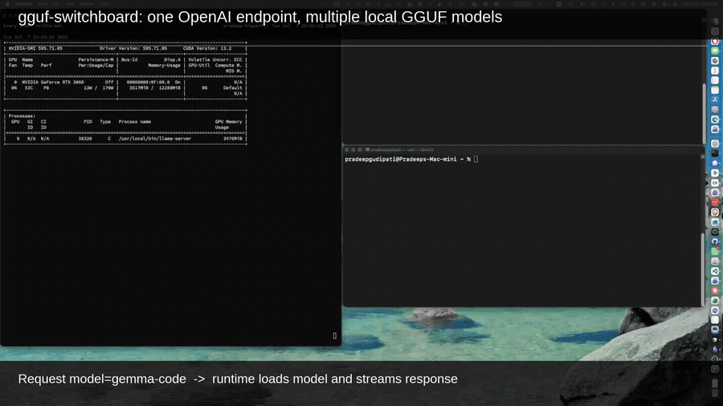
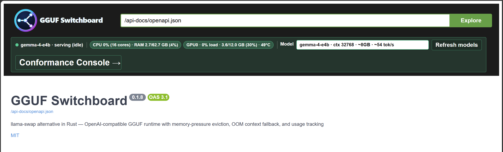
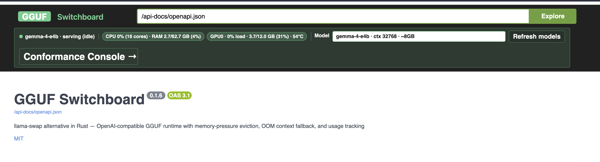

# GGUF Switchboard


**Run and switch between local GGUF and Safetensors models through one OpenAI-compatible API.**

GGUF Switchboard uses [llama.cpp](https://github.com/ggml-org/llama.cpp) for GGUF models and [vLLM](https://github.com/vllm-project/vllm) for Safetensors models. It downloads models from Hugging Face, evaluates what fits the available hardware, and safely swaps one model at a time without manual process, port, or VRAM management.

> **The local model router for llama.cpp and vLLM.**

> **Status:** Experimental. Built for single-GPU development machines and trusted home-lab deployments, not internet-facing multi-tenant serving.

## Top features

- **Two model formats, one API:** GGUF through llama.cpp and Hugging Face Safetensors through vLLM.
- **Automatic model lifecycle:** request-driven single-slot switching, in-flight request draining, failed-switch rollback, and idle priority warm-up.
- **Hardware-aware model management:** Hugging Face search and pull, GGUF quant scoring, vLLM quantization detection, VRAM fit checks, and bounded llama.cpp OOM fallback.
- **Broad client compatibility:** OpenAI Chat Completions, Completions, Embeddings, Responses, Rerank and Audio APIs, plus Anthropic Messages.
- **Built for operation:** Swagger UI with live GPU/CPU status, Prometheus metrics, usage history, a tool-calling conformance console with persisted run history, memory-pressure eviction, model rescans, and capability probing.

## Installation

Linux with NVIDIA/CUDA is the primary deployment target. The default installer sets up CUDA llama.cpp, an isolated vLLM environment, gguf-switchboard, and its systemd service:

```bash
git clone --branch main https://github.com/pradeepgudipati/gguf-switchboard.git
cd gguf-switchboard
./deploy.sh
```

Download and register either model format from Hugging Face:

```bash
# GGUF served by llama.cpp
gguf-switchboard models pull lmstudio-community/Qwen3.5-9B-GGUF --quant Q4_K_M --dir /var/lib/gguf-switchboard/models --registry /opt/gguf-switchboard/models.toml

# Safetensors served by vLLM
gguf-switchboard models pull vllm Qwen/Qwen2.5-7B-Instruct --dir /var/lib/gguf-switchboard/vllm-models --registry /opt/gguf-switchboard/models.toml
```

List the registered model IDs, then send a request through the same endpoint regardless of backend:

```bash
curl -s http://localhost:9090/v1/models | jq -r '.data[].id'

MODEL_ID="$(curl -s http://localhost:9090/v1/models | jq -r '[.data[] | select(.kind == "chat" or .kind == "coder" or .kind == "vision")][0].id')"
curl http://localhost:9090/v1/chat/completions \
  -H "Content-Type: application/json" \
  -d "$(jq -n --arg model "$MODEL_ID" '{
    model: $model,
    messages: [{role: "user", content: "Hello"}]
  }')"
```

Name the model you want. GGUF Switchboard selects its registered backend, unloads the resident model when necessary, starts the requested model, and forwards the request through the same API.

**Platform guides:** [Linux](docs/INSTALL-LINUX.md) · [macOS](docs/INSTALL-MACOS.md) · [Windows (WSL2)](docs/INSTALL-WINDOWS.md)

## Details



<sub>[▶ Watch with audio](docs/assets/demo.mp4)</sub>

### How it works

```
Models                              API endpoints
 GGUF → llama.cpp               →   /v1/chat/completions
 Safetensors → vLLM             →   /v1/completions
          ↓                         /v1/embeddings, /v1/rerank
    gguf-switchboard  ──────────▶   /v1/responses, /v1/audio/*
    (single-slot swap)               /v1/messages (Anthropic)
```

Request for model `B` while `A` is loaded → drain → unload `A` → load `B` → forward. After `idle_timeout`, the priority model warms back up. With `[fit]` enabled, each load is preceded by a hardware-aware planning step that picks safe context/nGL/KV parameters. Details in [Architecture](docs/ARCHITECTURE.md).

### Where it fits

| Tool | Best fit | Model lifecycle | Formats and backends |
|------|----------|-----------------|----------------------|
| **GGUF Switchboard** | Development machines and trusted home labs with more models than available GPU memory | Single-slot, request-driven switching with drain and rollback | GGUF via llama.cpp; Safetensors via vLLM |
| **Ollama** | Simple local model use with its own model library and CLI | Loads and unloads models with `keep_alive` | Ollama-managed models, including converted GGUF |
| **llama.cpp** | Direct, low-level GGUF inference | You manage each `llama-server` process and port | GGUF |
| **vLLM** | High-throughput serving of models that fit the available GPU resources | Serves configured models; no Switchboard lifecycle | Primarily Safetensors; [upstream GGUF support is experimental](https://docs.vllm.ai/en/latest/features/quantization/gguf/) |

Full landscape table and vs llama-swap feature matrix: [docs/COMPARISON.md](docs/COMPARISON.md).

### Supported scope

- **Primary target:** Linux, NVIDIA GPUs, and CUDA. See the separate [macOS](docs/INSTALL-MACOS.md) and [Windows](docs/INSTALL-WINDOWS.md) installation guides for platform-specific support.
- **One resident model:** the scheduler runs one model at a time across llama.cpp and vLLM. This is model switching, not concurrent multi-model serving.
- **Two explicit paths:** GGUF runs through llama.cpp; Safetensors runs through vLLM. GGUF Switchboard does not currently route GGUF through vLLM.
- **Trusted networks:** there is no built-in authentication. Do not expose the service directly to the public internet.
- **Hardware fit is estimated:** model size, context, KV cache, quantization, and runtime allocations can still cause a load to fail. Failed switches roll back to the previous model when possible.

### Swagger status header





### Conformance Console

The built-in [Conformance Console](http://localhost:9090/swagger-ui/conformance.html) diagnoses tool-calling and chat-template behavior that standard chat UIs cannot reveal:

- **Inspect** — Send a chat request and see exactly where the tool call ended up: a proper `tool_calls` entry, JSON dumped as plain text, JSON leaked into reasoning, or nothing at all.
- **Resolved Template** — View the actual prompt string a model's Jinja chat template produces. Catches broken or missing templates before they garble output.
- **Battery** — Run four standard tool-calling scenarios (single call, parallel calls, reasoning + call, tool-result summarization) and get a clear pass/fail table.
- **Compare** — Put two models side by side on the same task to see which handles tool calling better.
- **History** — Every run is saved to `conformance.db`. Track results across model versions or llama.cpp builds.

Works against both the local switchboard-managed model and any external OpenAI-compatible endpoint.

Full details: [docs/CONFORMANCE-CONSOLE.md](docs/CONFORMANCE-CONSOLE.md).

## Documentation

| Doc | Contents |
|-----|----------|
| **[docs/INSTALL-LINUX.md](docs/INSTALL-LINUX.md)** | Linux deployment, `deploy.sh`, manual builds, prebuilt binary, updates, troubleshooting |
| **[docs/INSTALL-MACOS.md](docs/INSTALL-MACOS.md)** | macOS build from source with Metal |
| **[docs/INSTALL-WINDOWS.md](docs/INSTALL-WINDOWS.md)** | Windows via WSL2 |
| **[docs/CONFIGURATION.md](docs/CONFIGURATION.md)** | `config.toml`, `models.toml`, `[fit]` section, discovery, context sizing, CLI |
| **[docs/USAGE.md](docs/USAGE.md)** | API examples (OpenAI + Anthropic), SDKs, IDE setup, monitoring, local run |
| **[docs/CONFORMANCE-CONSOLE.md](docs/CONFORMANCE-CONSOLE.md)** | Conformance Console: Inspect, Resolved Template, Battery, Compare, History |
| **[docs/ARCHITECTURE.md](docs/ARCHITECTURE.md)** | Scheduler/backend overview, ModelFitPlanner, kind guard, project layout |
| **[docs/COMPATIBILITY.md](docs/COMPATIBILITY.md)** | OpenAI + Anthropic endpoint coverage, feature matrix |
| **[docs/COMPARISON.md](docs/COMPARISON.md)** | Landscape vs Ollama / llama-swap / others |
| **[docs/QUANT_SCORING.md](docs/QUANT_SCORING.md)** | FIT/SPEED/BALANCED/PRECISION scoring formulas and sources |
| **[docs/BENCHMARKS.md](docs/BENCHMARKS.md)** | Throughput, swap latency, bench script |

### Quick reference

Swagger UI: **http://localhost:9090/swagger-ui/** — try-it-out API explorer with live model dropdown.

Conformance console: **http://localhost:9090/swagger-ui/conformance.html** — diagnose tool-calling and chat-template behavior of a local or external OpenAI-compatible model; runs are saved to `conformance.db`.

Configuration: two runtime files under **`/opt/gguf-switchboard/`** — **`config.toml`** (bind, idle timeout, `vram_gb`, `[fit]` section) and **`models.toml`** (aliases → GGUF/Safetensors paths). Full reference: [docs/CONFIGURATION.md](docs/CONFIGURATION.md).

```bash
# OpenAI Chat Completions
curl http://localhost:9090/v1/chat/completions \
  -H "Content-Type: application/json" \
  -d '{"model":"YOUR_ALIAS","messages":[{"role":"user","content":"Hello"}],"max_tokens":64}'

# Anthropic Messages API
curl http://localhost:9090/v1/messages \
  -H "Content-Type: application/json" \
  -H "x-api-key: not-needed" \
  -H "anthropic-version: 2023-06-01" \
  -d '{"model":"YOUR_ALIAS","max_tokens":64,"messages":[{"role":"user","content":"Hello"}]}'
```

## License

MIT
