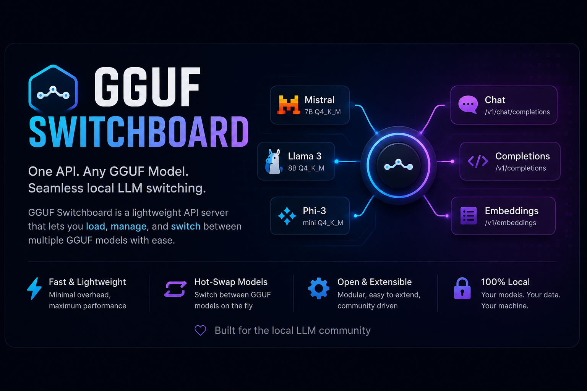

# GGUF Switchboard



**One API. Any GGUF Model. Seamless local LLM switching.**

A lightweight OpenAI and Anthropic-compatible API server that loads, manages, and switches between GGUF models on a single GPU. Point any OpenAI or Anthropic SDK or tool at it (Python, Node, Cursor, Cline, Continue) — no manual process or port juggling.

A **[llama-swap](https://github.com/mostlygeek/llama-swap) alternative in Rust** with system memory-pressure eviction, OOM-only context fallback, Swagger UI, Hugging Face metadata enrichment, and built-in usage tracking.

**Requires** [llama.cpp](https://github.com/ggerganov/llama.cpp) `llama-server` and GGUF model files — on Linux NVIDIA hosts install with `./scripts/update-llama-cpp.sh` (see [Quick Start](#quick-start)).

> **Status:** Experimental — single-GPU home labs and development machines on a **trusted LAN**. One model loaded at a time. System RAM is monitored for pressure eviction; `vram_gb` sizes context heuristically. Opt-in `auto_ngl` can pick GPU layers from free VRAM (nvidia-smi or `vram_gb` fallback) — still a heuristic, not live layer telemetry. Opt-in `[fit]` section enables a hardware-aware fit planner with bounded fallback ladder and profile caching. Tool-call capability is probed at load time for `tools`-tagged models. See [docs/COMPATIBILITY.md](docs/COMPATIBILITY.md).


<sub>[▶ Watch with audio](demo.mp4)</sub>

## Features

- **Fast & Lightweight** — Minimal overhead, maximum performance
- **Hot-Swap Models** — Switch between GGUF models on the fly
- **Open & Extensible** — Modular, easy to extend, community-driven
- **100% Local** — Your models. Your data. Your machine.

Also included:

- **OpenAI-compatible API** — `/v1/chat/completions`, `/v1/completions`, `/v1/embeddings`, `/v1/responses`, `/v1/models`, `/v1/models/registry.json`, `/v1/audio/*`
- **Anthropic Messages API** — `POST /v1/messages` (stream + non-stream); translated onto the loaded `llama-server` OpenAI backend; tool calling and content blocks supported
- **Tool calling** — Chat Completions forwards `tools` / `tool_choice` / `tool_calls`; the Responses API translates function tools, function calls, and strict streaming events to/from `llama-server`; Anthropic Messages translates tool definitions and calls bidirectionally. Actual model behavior depends on the model and llama.cpp build (see [COMPATIBILITY](docs/COMPATIBILITY.md))
- **Tool-call capability probe** — `tools`-tagged models are probed with a real tool call at load time; verdict exposed as `tools_verified` on `/v1/models`
- **Swagger UI** — Try-it-out at `http://localhost:9090/swagger-ui/` (live model dropdown, Rescan Models, hides chat vs embedding endpoints by selected model kind)
- **Auto-discovery** — Scans GGUF dirs with a cheap validation ladder (filename → header → metadata); sidecars skipped
- **Live model rescan** — `POST /v1/models/refresh` plus a configurable daily watcher (`models_rescan_interval_secs`); merges new GGUFs without a full redeploy
- **HF metadata enrichment** — fills empty `description` / context / VRAM / `capabilities` / `hf_repo` from Hugging Face on launch and rescan (`sync-hf-metadata` CLI also available)
- **Model management** — `models search`, `models files`, and `models pull` for one-command GGUF discovery, download, validation, and registry from Hugging Face
- **Quant scoring** — `models search`/`models files` score every discovered quant against your detected hardware: a 0–100 FIT score, an estimated tok/s from a memory-bandwidth model, and a precision-retention % from published per-quant perplexity data, then recommend the fastest, most balanced, and least-lossy quant separately with `Try:` pull commands (see [docs/QUANT_SCORING.md](docs/QUANT_SCORING.md))
- **Kind-aware routing** — chat / completions / messages / responses require chat-like kinds; embeddings require `embedding` (and pass `--embeddings` to `llama-server`)
- **Single-slot hot-swap** — One resident model; switches drain in-flight requests; failed switches roll back
- **Memory-pressure eviction** — Unloads when system RAM crosses the critical threshold
- **Auto GPU layers (`auto_ngl`)** — Opt-in: at load, pick `-ngl` from free VRAM + GGUF size (manual `ngl` / `extra_args` still win)
- **ModelFitPlanner** — Opt-in `[fit]` section: inspects GPU topology and free VRAM before every load to produce a safe launch profile; bounded fallback ladder on OOM; caches known-good profiles to skip the ladder on subsequent loads
- **Idle priority model** — Preferred model auto-loads after a configurable idle timeout
- **llama.cpp backend** — Spawns and manages `llama-server` child processes
- **SSE streaming**, **Prometheus** (`/metrics`), **usage history** (`/v1/usage`), **portable `models.json`**

### How it works

```
Models (GGUF)                    API endpoints
 Mistral / Llama / Phi / …   →   /v1/chat/completions
         ↓                       /v1/completions
   gguf-switchboard  ─────────▶  /v1/embeddings
   (single-slot swap)            /v1/responses, /v1/audio/*
                                 /v1/messages (Anthropic)
```

Request for model `B` while `A` is loaded → drain → unload `A` → load `B` → forward. After `idle_timeout`, the priority model warms back up. With `[fit]` enabled, each load is preceded by a hardware-aware planning step that picks safe context/nGL/KV parameters. Details in [Architecture](docs/ARCHITECTURE.md).

## Why gguf-switchboard

When running local LLMs you usually juggle `llama-server` processes, ports, and GPU memory by hand. gguf-switchboard is a **llama-swap-style swap proxy in Rust** for constrained GPUs: memory-pressure eviction, OOM context fallback, hardware-aware fit planner, idle priority model, HF-enriched registry metadata, and usage tracking — one OpenAI/Anthropic endpoint, llama.cpp only.

Full landscape table and vs llama-swap feature matrix: **[docs/COMPARISON.md](docs/COMPARISON.md)**.

## Quick Start

### Prerequisites

gguf-switchboard is a **swap proxy** — it does not run inference itself. You need a working **[llama.cpp](https://github.com/ggerganov/llama.cpp)** `llama-server` and GGUF models on disk before the systemd service will stay enabled.

| Requirement | Notes |
|-------------|--------|
| **`llama-server` (required)** | From [llama.cpp](https://github.com/ggerganov/llama.cpp). On Linux NVIDIA hosts prefer `./scripts/update-llama-cpp.sh` → `/usr/local/bin/llama-server`. Otherwise put it on `PATH` or set `defaults.llama_server` in `models.toml`. |
| **GGUF model files** | Directory of `.gguf` weights (system default: `/var/lib/gguf-switchboard/models`). |
| **Linux** (recommended) | Ubuntu/Debian for `deploy.sh` (`apt`). Other distros: install build deps yourself. |
| **macOS** | Build from source only — no systemd. See [macOS](#macos). |
| **Rust** | Installed automatically by `deploy.sh` if missing; otherwise [rustup](https://rustup.rs/). |
| **GPU stack** | NVIDIA + CUDA toolkit on Linux, or Apple Metal on macOS (CPU-only llama.cpp works but is slow). |

### Install (Linux + NVIDIA / CUDA)

Clone the repo, install a CUDA `llama-server` into `/usr/local`, then deploy the switchboard service:

```bash
git clone --branch main https://github.com/pradeepgudipati/gguf-switchboard.git
cd gguf-switchboard

# 1) Build + install llama.cpp with CUDA (idempotent upgrade path)
#    Run as your user; the script sudo's only for install / service steps.
./scripts/update-llama-cpp.sh

# 2) Build + install gguf-switchboard and enable the systemd unit
./deploy.sh
```

`./scripts/update-llama-cpp.sh` does: check CUDA → clone/pull `~/llama.cpp` → CUDA Release build → verify GPU → stop `gguf-switchboard` if present → `cmake --install` to `/usr/local` → strip stale RUNPATH → `ldconfig` → assert libs are not resolved from the source build tree → restart the unit only if it exists.

Overrides: `LLAMA_DIR` (default `~/llama.cpp`), `PREFIX` (default `/usr/local`), `SERVICE` (default `gguf-switchboard`), `SKIP_PULL=1`, `SKIP_SERVICE=1`.

`deploy.sh` does **not** install llama.cpp. It requires `/usr/local/bin/llama-server` (`--version` must succeed). If missing or broken, deploy exits after installing the switchboard binary and prints `./scripts/update-llama-cpp.sh` help. If no GGUF models are registered yet, the unit is installed but left stopped.

What `deploy.sh` does when ready:

1. Pulls latest `main` (stashes dirty working tree first — see [Updating](#updating))
2. Creates system user `ggs` and directories under `/opt/gguf-switchboard` + `/var/lib/gguf-switchboard`
3. Installs build deps + Rust if needed
4. Builds the release binary → `/usr/local/bin/gguf-switchboard` (root-owned)
5. Syncs the project into `/opt/gguf-switchboard` (skips rsync if already running from there)
6. Writes `config.toml` / generates `models.toml` with absolute system paths
7. Installs the systemd unit as `User=ggs` / `Group=ggs`, then `daemon-reload` + `enable --now`
8. Validates `ggs` can read configs/models and execute both binaries; checks `/health`

```bash
# Optional: copy legacy ~/models into the system models dir (never deletes the source)
./deploy.sh --migrate-models

# Discover from an alternate directory while still registering the canonical models_dir
MODELS_DIR=/path/to/gguf-files ./deploy.sh --refresh-models
```

Then open **http://localhost:9090/swagger-ui/**.

If the binary is not on `PATH`, point the registry at it:

```toml
# models.toml
[defaults]
llama_server = "/path/to/llama-server"
```

#### Manual llama.cpp (optional)

Prefer `./scripts/update-llama-cpp.sh` on CUDA hosts — it installs shared libs correctly and strips RUNPATH. Manual one-shot (binary copy only):

```bash
git clone https://github.com/ggerganov/llama.cpp.git
cd llama.cpp
cmake -B build -DGGML_CUDA=ON
cmake --build build --config Release -j"$(nproc)"
sudo cp build/bin/llama-server /usr/local/bin/
llama-server --version
```

**macOS (Metal)** — no systemd; build `llama-server` yourself, then use [Build without systemd](#build-without-systemd):

```bash
git clone https://github.com/ggerganov/llama.cpp.git
cd llama.cpp
cmake -B build -DGGML_METAL=ON
cmake --build build --config Release -j"$(sysctl -n hw.ncpu)"
sudo cp build/bin/llama-server /usr/local/bin/
llama-server --version
```

### Prebuilt binary (Linux)

Still needs a working `llama-server` first (`./scripts/update-llama-cpp.sh` on CUDA hosts).

```bash
# amd64 (see Releases for arm64 + checksums)
curl -fsSL -o gguf-switchboard \
  https://github.com/pradeepgudipati/gguf-switchboard/releases/latest/download/gguf-switchboard-linux-amd64
chmod +x gguf-switchboard
sudo mv gguf-switchboard /usr/local/bin/

# Copy the tracked examples to system runtime paths (or run ./deploy.sh)
git clone --branch main --depth 1 https://github.com/pradeepgudipati/gguf-switchboard.git
cd gguf-switchboard
sudo mkdir -p /opt/gguf-switchboard /var/lib/gguf-switchboard/models
sudo cp config.example.toml /opt/gguf-switchboard/config.toml
gguf-switchboard discover-models /var/lib/gguf-switchboard/models -o /opt/gguf-switchboard/models.toml
gguf-switchboard /opt/gguf-switchboard/config.toml
```

### Build without systemd

Local binary only — no `sudo`, no systemd (Linux or macOS):

```bash
git clone --branch main https://github.com/pradeepgudipati/gguf-switchboard.git
cd gguf-switchboard
cargo build --release

cp config.example.toml config.toml
cp models.example.toml models.toml
./target/release/gguf-switchboard discover-models ~/models -o models.toml
./target/release/gguf-switchboard config.toml
```

### macOS

`deploy.sh` is **Linux-only** (systemd). On a Mac, use [Build without systemd](#build-without-systemd).

| Step | Linux (`deploy.sh`) | macOS |
|------|---------------------|-------|
| Clone + `cargo build` | Yes | Yes |
| Model discovery | Yes | Yes |
| systemd auto-start | Yes | No — terminal or your own `launchd` plist |
| Auto-install build deps | Yes (`apt`) | Xcode CLI tools; `jq` via Homebrew if needed |

Use a **Metal** build of `llama-server`. Create runtime files from `config.example.toml` / `models.example.toml`; keep user-owned `config.toml` / `models.toml` in the checkout.

### Install GGUF models

With gguf-switchboard installed, search, browse, and download GGUF models from Hugging Face:

```bash
sudo mkdir -p /var/lib/gguf-switchboard/models

# Search for models
gguf-switchboard models search "Qwen3.5 9B"

# Browse available files in a repo
gguf-switchboard models files lmstudio-community/Qwen3.5-9B-GGUF

# Download, validate, and register a model (runs a quick speed test if the server is up)
gguf-switchboard models pull lmstudio-community/Qwen3.5-9B-GGUF --quant Q4_K_M --dir /var/lib/gguf-switchboard/models

# Optional: tune parallel aria2 connections (default 8, maximum 16)
gguf-switchboard models pull lmstudio-community/Qwen3.5-9B-GGUF --quant Q4_K_M --connections 8

# Skip the post-pull speed test
gguf-switchboard models pull lmstudio-community/Qwen3.5-9B-GGUF --quant Q4_K_M --no-bench
```

`models search` scores every discovered quant against your detected RAM/VRAM and prints the fastest, most balanced, and least-lossy one separately, instead of a flat "supported: yes/no":

```
Hardware: System RAM 32.0 GiB | NVIDIA VRAM 24.0 GiB | Total 56.0 GiB
Speed model inputs: GPU bandwidth 1008 GB/s (NVIDIA GeForce RTX 4090) | RAM bandwidth 40 GB/s (assumed) | GPU efficiency 0.55 | CPU efficiency 0.35

REPO                          | FILES | SIZE    | FIT | CONTEXT   | ARCH  | SPEED           | BALANCED               | PRECISION   | QUANT
bartowski/Qwen3.5-9B-GGUF     |    24 | 9421 MB | 100 | 32768 tok | qwen3 | Q4_K_M ~127tok/s | Q5_K_M ~91tok/s/~98.9% | Q6_K ~99.6% | Q2_K,Q3_K_M,Q4_K_M,Q5_K_M,Q6_K,Q8_0
...
Try: ggs models pull bartowski/Qwen3.5-9B-GGUF --quant Q4_K_M   (fastest, ~127 tok/s est.)
     ggs models pull bartowski/Qwen3.5-9B-GGUF --quant Q5_K_M   (balanced, ~91 tok/s / ~98.9% quality est.)
     ggs models pull bartowski/Qwen3.5-9B-GGUF --quant Q6_K   (least precision loss, ~99.6% quality est.)
```

FIT is a continuous 0–100 memory-fit score (replaces the old binary "Supported: Yes/No"). SPEED/PRECISION show whichever quant maximizes each dimension for your machine; BALANCED is the one quant that gives up the least on both instead of maxing out either extreme — see [docs/QUANT_SCORING.md](docs/QUANT_SCORING.md) for the exact formulas, sources, and how to override RAM bandwidth (`--ram-bandwidth-gbps`) with a measured value.

Public downloads automatically use `aria2c` when available, then verify the expected size, Hugging Face LFS checksum, and GGUF metadata before registration. If Hugging Face rejects parallel range requests, the native downloader resumes the partial file. Authenticated downloads using `HF_TOKEN`, or systems without `aria2c`, use the native downloader directly. A successful pull refreshes a running gguf-switchboard server automatically and (unless `--no-bench`) runs a short chat completion to print prompt and generation tok/s.

Or download manually — any `.gguf` file in `/var/lib/gguf-switchboard/models` works:

```bash
# Example layout after manual download:
#   /var/lib/gguf-switchboard/models/Qwen3.5-9B-Q4_K_M.gguf
#   /var/lib/gguf-switchboard/models/gemma-4-E4B-it-Q4_K_M.gguf
```

If you downloaded models manually, run `./deploy.sh --refresh-models` so discovery registers them.

### Verify

```bash
curl -s http://localhost:9090/health
curl -s http://localhost:9090/status | jq .
curl -s http://localhost:9090/v1/models | jq '.data[].id'

# NVIDIA processes with the loaded GGUF model name
./scripts/nvidia-smi-models.sh
./scripts/nvidia-smi-models.sh --watch 2
```

The model-aware NVIDIA view joins `nvidia-smi` process data with each process's
`-m` or `--model` argument from `/proc`. Run it as the same user as
`llama-server`, or with sufficient permission to read that process's command
line. Processes whose command line is inaccessible show `-` for the model.

### Updating

Supported upgrade path from an existing checkout:

```bash
cd ~/gguf-switchboard   # or wherever you cloned

# Refresh CUDA llama-server first when the backend changed upstream
./scripts/update-llama-cpp.sh

# Then rebuild / reinstall the switchboard service
./deploy.sh
```

| Goal | Command |
|------|---------|
| Pull + rebuild + restart switchboard | `./deploy.sh` |
| Rebuild only (no `git pull`) | `./deploy.sh --skip-pull` |
| Install / refresh CUDA `llama-server` in `/usr/local` | `./scripts/update-llama-cpp.sh` |
| Pick up new GGUF files (merge registry) | `./deploy.sh --refresh-models` |
| Copy legacy `~/models` into system models dir | `./deploy.sh --migrate-models` |
| Live rescan while running | `curl -X POST http://localhost:9090/v1/models/refresh` (or Swagger **Rescan Models**) |
| Restart without rebuild | `sudo systemctl restart gguf-switchboard` |

**Important:**

- Deploy **stashes uncommitted changes** (including untracked files) before `git pull`. Recover with `git stash list` / `git stash pop`.
- Live config lives under `/opt/gguf-switchboard/` (`config.toml`, `models.toml`); models and `usage.db` under `/var/lib/gguf-switchboard/`. Tracked defaults live in `config.example.toml` and `models.example.toml`.
- After editing aliases / `priority` / `extra_args`, restart: `sudo systemctl restart gguf-switchboard`.
- `deploy.sh` will not start the unit if `/usr/local/bin/llama-server` is missing/broken or no GGUF models are registered — fix with `./scripts/update-llama-cpp.sh` and/or model pull, then re-run deploy.

```bash
# Logs
sudo systemctl status gguf-switchboard
sudo journalctl -u gguf-switchboard -f
```

### Shell alias (optional)

Add a short `ggs` alias so you can type `ggs` instead of `gguf-switchboard`. `deploy.sh` offers to add this automatically on Linux without conflicting with the common `gs='git status'` alias.

**Linux (bash):**

```bash
echo "alias ggs='gguf-switchboard'" >> ~/.bashrc
source ~/.bashrc
```

**Linux / macOS (zsh):**

```bash
echo "alias ggs='gguf-switchboard'" >> ~/.zshrc
source ~/.zshrc
```

**Windows (PowerShell):**

```powershell
# Add to your PowerShell profile
if (!(Test-Path $PROFILE)) { New-Item -Path $PROFILE -Force }
Add-Content $PROFILE "Set-Alias -Name ggs -Value gguf-switchboard"
. $PROFILE
```

After that:

```bash
ggs models search "Qwen3.5"
ggs models pull lmstudio-community/Qwen3.5-9B-GGUF --quant Q4_K_M
ggs config.toml
```

### Troubleshooting first install

| Symptom | Likely fix |
|---------|------------|
| Deploy exits; prints `./scripts/update-llama-cpp.sh` | Install or refresh CUDA `llama-server` into `/usr/local/bin`: `./scripts/update-llama-cpp.sh`, then `./deploy.sh` |
| `llama-server: not found` / models fail to load | Same as above |
| Service unhealthy / no models | Put GGUFs in `/var/lib/gguf-switchboard/models` and run `./deploy.sh --refresh-models` |
| First install has no GGUF models | Not fatal. Installer leaves the service stopped and prints `ggs models search`, `ggs models pull`, and `./deploy.sh --refresh-models` |
| Empty `/v1/models` | Check `models_dir` in `/opt/gguf-switchboard/models.toml`; enable `auto_discover = true`; restart |
| Deploy "lost" my edits | `git stash list` — deploy stashes dirty trees before pull |
| Port 9090 in use | Change `bind` in `/opt/gguf-switchboard/config.toml` and restart |

## Further documentation

| Doc | Contents |
|-----|----------|
| **[docs/CONFIGURATION.md](docs/CONFIGURATION.md)** | `config.toml`, `models.toml`, `[fit]` section, discovery, context sizing, CLI |
| **[docs/USAGE.md](docs/USAGE.md)** | API examples (OpenAI + Anthropic), SDKs, IDE setup, monitoring, local run |
| **[docs/ARCHITECTURE.md](docs/ARCHITECTURE.md)** | Scheduler/backend overview, ModelFitPlanner, kind guard, project layout |
| **[docs/COMPARISON.md](docs/COMPARISON.md)** | Landscape vs Ollama / llama-swap / others |
| **[docs/BENCHMARKS.md](docs/BENCHMARKS.md)** | Throughput, swap latency, bench script |
| **[docs/COMPATIBILITY.md](docs/COMPATIBILITY.md)** | OpenAI + Anthropic endpoint coverage, feature matrix |
| **[docs/QUANT_SCORING.md](docs/QUANT_SCORING.md)** | FIT/SPEED/BALANCED/PRECISION scoring formulas and sources |

### Configuration (short)

Two runtime files under **`/opt/gguf-switchboard/`**: **`config.toml`** (bind, idle timeout, `vram_gb`, `[fit]` section) and **`models.toml`** (aliases → GGUF paths). Models live in **`/var/lib/gguf-switchboard/models/`**. Full reference: [docs/CONFIGURATION.md](docs/CONFIGURATION.md).

```bash
# After install, tweak models then restart
sudo systemctl restart gguf-switchboard
```

### Try the API

```bash
# OpenAI Chat Completions
curl http://localhost:9090/v1/chat/completions \
  -H "Content-Type: application/json" \
  -d '{"model":"YOUR_ALIAS","messages":[{"role":"user","content":"Hello"}],"max_tokens":64}'

# Anthropic Messages API
curl http://localhost:9090/v1/messages \
  -H "Content-Type: application/json" \
  -H "x-api-key: not-needed" \
  -H "anthropic-version: 2023-06-01" \
  -d '{"model":"YOUR_ALIAS","max_tokens":64,"messages":[{"role":"user","content":"Hello"}]}'
```

Swagger UI: **http://localhost:9090/swagger-ui/** — more examples in [docs/USAGE.md](docs/USAGE.md).

## License

MIT
