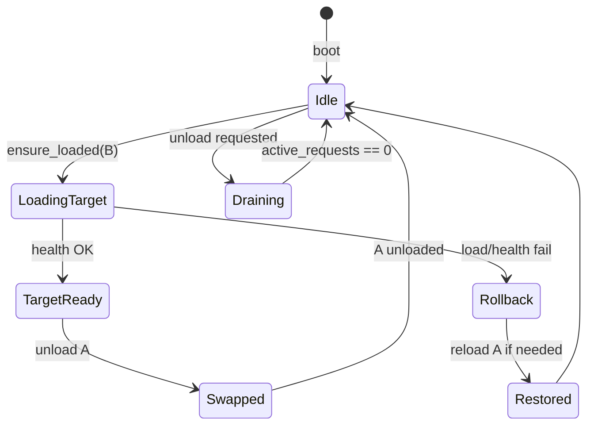
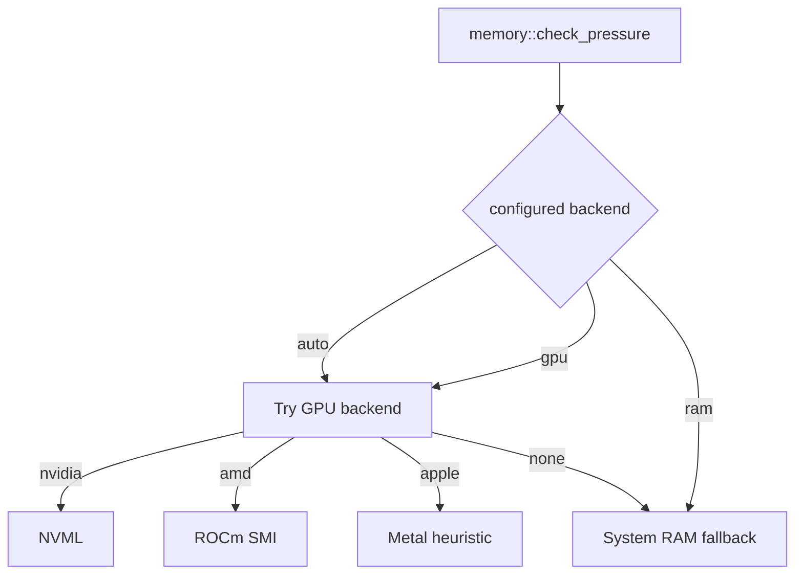

# refactor: Credibility, scheduler correctness, and test hardening

## Summary

Address the technical credibility and reliability gaps identified in the v0.1.2 review: align documentation with actual behavior, make model switching transactional and request-safe, classify OOM before context fallback, harden background tasks, improve CI, and add integration tests. **Explicitly out of scope:** API-key auth, default bind to `127.0.0.1`, rate limits, request-size limits, and other enterprise security hardening — this project targets trusted LAN / home-lab use.

## Problem Frame

The README and release notes overstate capabilities relative to the implementation. The scheduler is functionally a **single-slot swapper** with **system-RAM monitoring**, but is marketed as VRAM-aware LRU scheduling. Switching is not transactional (failed loads can leave no model resident), context fallback fires on any load failure, and unload does not wait for in-flight SSE streams. These gaps undermine trust and cause real failures for parallel IDE agent workloads.

## Requirements

| ID | Requirement | Source |
|----|-------------|--------|
| R1 | Rename memory-pressure terminology unless GPU VRAM is actually queried | Review #1 |
| R2 | Rename LRU / multi-model language to single-slot swapping (or implement `max_loaded > 1` — deferred) | Review #2 |
| R3 | Apply context fallback only for allocation/OOM-class failures | Review #3 |
| R4 | Roll back to the previously loaded model when a switch fails | Review #4 |
| R5 | Drain or block unload while requests are active on the loaded backend | Review #5 |
| R6 | Priority watcher must respect active requests and recent load failures | Review #6 |
| R7 | Background watchers must participate in graceful shutdown | Review #7 |
| R8 | Publish honest maturity positioning and compatibility matrix | Review #9, #13 |
| R9 | Detect and report llama-server version; document tested range | Review #14 |
| R10 | Add scheduler integration tests with a fake llama-server fixture | Review #10 |
| R11 | Scope CI permissions; pin Actions to commit SHAs | Review #11, #12 |
| R12 | Add ADR explaining positioning vs llama-swap | Review P2 |

## Key Technical Decisions

### KTD-1: Documentation-first for memory and scheduling semantics (Phase 1)

**Decision:** Rename "VRAM-pressure eviction" → **memory-pressure eviction** and "LRU scheduler" → **single-slot model swapping** across README, `Cargo.toml`, release notes, and OpenAPI description. Keep `vram_gb` as a **context-sizing heuristic** (file-size based), not a claim of live GPU monitoring.

**Rationale:** `src/memory/mod.rs` reads `/proc/meminfo` (Linux) or `sysctl`/`vm_stat` (macOS) — system RAM only. Shipping renamed docs is low risk and restores credibility immediately.

**Deferred:** GPU VRAM backends (NVML, ROCm SMI, Metal) are a separate Phase 2+ effort behind a `memory_backend` config knob. Not required to fix the misleading claim.

### KTD-2: Transactional switch with rollback (Phase 1)

**Decision:** Refactor `ensure_loaded` so unloading the current model happens **only after** the target model is healthy, OR capture `(previous_model_id, previous_runtime_args)` and reload on failure.

**Preferred approach:** **Load-then-unload** within `load_lock`:
1. Load requested model into a side slot (backend map already supports multiple backends; only `loaded` is single-valued).
2. Health-check the new backend.
3. On success: unload previous, set `loaded`.
4. On failure: unload partial new backend, restore `loaded` to previous (re-load previous if it was unloaded).

**Rationale:** Matches user expectation that a bad model name does not brick the proxy.

### KTD-3: OOM classification before context fallback (Phase 1)

**Decision:** Capture stderr from `llama-server` child process during startup window. Introduce `LoadFailureKind` enum (`Oom`, `MissingFile`, `PortConflict`, `InvalidArgs`, `ProcessExit`, `HealthTimeout`, `Unknown`). Only `Oom` (and optionally `Unknown` when stderr is empty after timeout on large context) triggers `try_reduce_context`.

**Patterns to match (initial set):** `out of memory`, `CUDA error`, `cudaMalloc`, `failed to allocate`, `ggml_*alloc`, `Metal: insufficient`, `VK_ERROR_OUT_OF_DEVICE_MEMORY`, `cannot allocate`.

**Rationale:** `load_model_with_context_fallback` currently retries on any `load()` or health failure (`src/scheduler/mod.rs`).

### KTD-4: Per-model request draining (Phase 1)

**Decision:** Add `ModelActivity` tracker on `SchedulerInner`:
- `active_requests: RwLock<HashMap<String, u32>>` incremented/decremented via scheduler API called from API handlers (replace raw `ACTIVE_REQUESTS` coupling or mirror it per model).
- `unload_model(id)` waits until `active_requests[id] == 0` or `drain_timeout` elapses.
- `ensure_loaded` for a different model: if current model has active requests, either **queue** the switch (hold `load_lock`, wait for drain) or return **409 Conflict** with `Retry-After` — default **wait with configurable `switch_drain_timeout_secs`** (e.g. 120s) for home-lab friendliness.

**Rationale:** `ACTIVE_REQUESTS` is global (`src/metrics/mod.rs`); scheduler does not consult it before unload (`ensure_loaded` lines 172–186).

### KTD-5: Priority watcher gating (Phase 1)

**Decision:** Before priority swap, skip if:
- Any `active_requests` > 0 on the loaded model
- A user-initiated switch occurred within the last N seconds (track `last_switch_at`)
- Last load of priority model failed within cooldown window (track `last_priority_load_failed_at`)

**Rationale:** 30s poll + idle-only timestamp is insufficient (`start_priority_watcher`).

### KTD-6: Watcher lifecycle (Phase 1)

**Decision:** Return `WatcherHandles` from scheduler holding `JoinHandle<()>` + `CancellationToken` (tokio-util). `main.rs` cancels on shutdown signal before `scheduler.shutdown()`.

### KTD-7: CI hardening without security scope creep (Phase 2)

**Decision:** Default `permissions: contents: read`; grant `contents: write` only on `release` job. Pin third-party actions to full SHAs with a comment linking to the tag.

### KTD-8: Honest positioning (Phase 1 docs)

**Decision:** Add `## Project status` section:

> Experimental Rust model-switching proxy for llama.cpp, designed for single-GPU home labs and development machines on a trusted LAN.

Remove "production-ready" and "full OpenAI compatibility". Add `docs/COMPATIBILITY.md` matrix.

---

## High-Level Technical Design

### Model switch state machine

### Memory monitoring layers (future)

Phase 1 ships only **G** with honest naming. Phase 3 optionally adds D/E/F.

---

## Scope Boundaries

### In scope

- README / release note / OpenAPI description honesty
- Scheduler correctness (rollback, drain, OOM classification)
- Priority and memory watcher lifecycle
- Integration test fixture
- CI permissions and SHA pinning
- Compatibility matrix, ADR, llama version reporting

### Out of scope (per user)

- API-key authentication
- Changing default bind away from `0.0.0.0` for LAN use
- Rate limits, request-size limits, model allowlisting for security
- TLS / reverse-proxy guidance beyond a short LAN note
- Implementing `max_loaded > 1` multi-model residency (deferred — single GPU home lab)

### Deferred to Follow-Up Work

- GPU VRAM backends (NVML / ROCm / Metal)
- `max_loaded > 1` with memory-based placement
- Measured switch-time benchmarks in CI
- macOS runtime integration job (compile-only today)
- Screenshots in README (manual asset capture)

---

## Implementation Units

### U1. Documentation honesty pass

**Goal:** Align all user-facing text with actual behavior.

**Requirements:** R1, R2, R8

**Files:**
- `README.md`
- `CHANGELOG.md`
- `releases/v0.1.2.md` (if editing retroactively) or `releases/v0.1.3.md`
- `Cargo.toml`
- `src/api/mod.rs` (OpenAPI description)

**Approach:**
- Replace "VRAM-pressure eviction" → "memory-pressure eviction"
- Replace "LRU" / "VRAM-aware scheduling" → "single-slot model swapping"
- Replace "context OOM fallback" → "context reduction on OOM"
- Add `## Project status` with experimental / home-lab positioning
- Clarify `vram_gb` sizes context heuristically from model file size, not live GPU telemetry
- Update comparison table row for gguf-switchboard

**Test scenarios:** Test expectation: none — documentation only.

**Verification:** Grep confirms no remaining "VRAM-pressure" or "production-ready" claims; comparison table matches code behavior.

---

### U2. OOM failure classification

**Goal:** Context fallback only on allocation failures.

**Requirements:** R3

**Dependencies:** None (can land before U3)

**Files:**
- `src/backend/llama_cpp.rs` — stderr capture task during startup
- `src/errors/mod.rs` — `LoadFailureKind`, `ClassifiedLoadError`
- `src/scheduler/mod.rs` — gate `try_reduce_context` on kind

**Approach:**
1. On `load()`, spawn a task reading stderr lines into a bounded `VecDeque<String>` (ring buffer ~64 KiB).
2. On load/health/process-exit failure, classify from stderr + error message.
3. `try_reduce_context` returns `Ok(None)` unless kind is `Oom`.
4. Log classified kind at `warn` for observability.

**Test scenarios:**
- stderr containing `out of memory` → context halved
- stderr containing `address already in use` → no context change, error returned
- missing GGUF path → no context change (`ModelNotFound` path in `load()`)
- process exit with no OOM signature → no context change

**Files (tests):** `src/backend/llama_cpp.rs` (`#[cfg(test)]` classifier unit tests), later `tests/scheduler_oom.rs`

**Verification:** Unit tests for classifier; manual load with bad port does not reduce `-c`.

---

### U3. Transactional switch with rollback

**Goal:** Failed switch never leaves the service without a working model.

**Requirements:** R4

**Dependencies:** U2 (optional but recommended)

**Files:**
- `src/scheduler/mod.rs` — refactor `ensure_loaded`, `load_model_with_context_fallback`
- `src/errors/mod.rs` — optional `SwitchRollbackError`

**Approach:**
1. Extract `switch_to_model(target_id) -> Result<(), RuntimeError>`.
2. If `loaded == target`, fast-path return.
3. Under `load_lock`:
   - Remember `previous = loaded.clone()`.
   - Load `target` without unloading `previous` first.
   - On success: unload `previous`, set `loaded = Some(target)`.
   - On failure: ensure `target` backend removed; if `previous` was unloaded prematurely, call `load_model_with_context_fallback(previous)` and restore `loaded`.
4. Apply same pattern to priority watcher unload path.

**Test scenarios:**
- Model A loaded and healthy; switch to broken B → A still loaded and healthy
- Model A loaded; switch to B succeeds → only B loaded
- Switch to B fails after A was never unloaded (load-then-unload) → A uninterrupted

**Files (tests):** `tests/scheduler_switch.rs` (with fake backend from U8)

**Verification:** Integration test proves A remains servable after B failure.

---

### U4. Per-model request draining

**Goal:** No unload while streams are active.

**Requirements:** R5

**Dependencies:** U3 (unload paths must call drain)

**Files:**
- `src/scheduler/mod.rs` — `begin_request(model_id)`, `end_request(model_id)`, `drain_model(model_id, timeout)`
- `src/state/mod.rs` — expose scheduler hooks
- `src/api/chat.rs`, `completions.rs`, `embeddings.rs`, `responses.rs`, `audio.rs`
- `src/config/mod.rs` — `switch_drain_timeout_secs` (default 120)
- `config.toml`, `README.md`

**Approach:**
1. Scheduler tracks per-model active count (not just global Prometheus gauge).
2. API handlers call `scheduler.begin_request(&model_id)` before inference and hold an RAII guard through stream lifetime (extend `GuardedStream` pattern).
3. `unload_model` calls `drain_model` first.
4. `ensure_loaded` when switching: wait up to timeout for drain; on timeout return `RuntimeError::ModelBusy` (HTTP 409).

**Test scenarios:**
- Slow SSE stream on A; switch request to B waits until stream completes
- Drain timeout exceeded → 409 with clear error body
- Non-streaming request: counter decrements after response sent

**Verification:** Integration test with fake server that delays stream end.

---

### U5. Priority watcher hardening

**Goal:** Priority model does not preempt active work.

**Requirements:** R6

**Dependencies:** U4

**Files:**
- `src/scheduler/mod.rs` — `start_priority_watcher`
- `src/config/mod.rs` — `priority_load_cooldown_secs` (default 300)

**Approach:**
- Gate swap on `active_requests.values().any(|&n| n > 0)`
- Track `last_user_switch_at` updated in `ensure_loaded`
- Track `priority_load_failed_at`; skip retries during cooldown
- Log skip reason at `debug`

**Test scenarios:**
- Active request on non-priority model → priority watcher does not unload
- Failed priority load → no retry for cooldown period
- Idle past timeout, no active requests → priority loads

**Verification:** Integration test with controlled clocks or short timeouts.

---

### U6. Background task lifecycle

**Goal:** Watchers stop cleanly on shutdown.

**Requirements:** R7

**Dependencies:** None

**Files:**
- `src/scheduler/mod.rs`
- `src/main.rs`
- `Cargo.toml` — add `tokio-util` if using `CancellationToken`

**Approach:**
1. `Scheduler::start_watchers() -> WatcherHandles` spawns both tasks with shared cancel token.
2. Loop uses `tokio::select!` on `cancel.cancelled()` vs sleep.
3. `main.rs`: on shutdown signal, `handles.cancel()`, `handles.join().await`, then `scheduler.shutdown()`.

**Test scenarios:**
- Spawn scheduler + watchers; cancel; assert tasks exit within 2s
- Test expectation: none for HTTP — unit/integration on scheduler only

**Verification:** Test calls `WatcherHandles::cancel` and awaits join.

---

### U7. llama-server version detection

**Goal:** Report tested upstream compatibility.

**Requirements:** R9

**Files:**
- `src/backend/llama_cpp.rs` — run `{command} --version` or parse from stderr banner on first load
- `src/api/health.rs` or `src/api/metrics.rs` — expose version in `/health` or `/metrics` info
- `README.md`, `docs/COMPATIBILITY.md`

**Approach:**
- Cache version string per process lifetime
- Document tested range (e.g. llama.cpp bXXXX–bYYYY) based on maintainer verification
- Log at startup: `llama_server_version=...`

**Test scenarios:**
- Fake command that prints `version: 1.2.3` → parsed correctly
- Missing version flag → graceful `unknown`

**Verification:** Unit test for parser; health endpoint includes field.

---

### U8. Fake llama-server test fixture

**Goal:** Enable scheduler integration tests without real GGUF/GPU.

**Requirements:** R10

**Files:**
- `tests/support/fake_llama_server.rs` (new)
- `tests/scheduler_switch.rs`, `tests/scheduler_drain.rs` (new)
- `tests/support/mod.rs`

**Approach:**
- Small async HTTP server mimicking `/health` and `/v1/chat/completions` (SSE optional)
- Config uses `command` pointing to a test binary or shell wrapper that starts the fake server
- Modes: `healthy`, `slow_stream`, `fail_startup`, `oom_stderr`

**Test scenarios:**
- Rollback (U3), drain (U4), priority gating (U5), OOM vs port conflict (U2)

**Verification:** `cargo test --test scheduler_switch` passes in CI.

---

### U9. CI permissions and SHA pinning

**Goal:** Least-privilege CI and supply-chain hygiene.

**Requirements:** R11

**Files:**
- `.github/workflows/ci.yml`

**Approach:**
1. Top-level `permissions: contents: read`
2. `release` job: `permissions: contents: write`
3. Replace `@v5` / `@v2` / `@v4` with full commit SHAs; comment original tag
4. Add `integration` job running `cargo test --tests` (includes new scheduler tests)

**Test scenarios:** Test expectation: none — workflow validation on PR.

**Verification:** PR CI green; release job still publishes assets.

---

### U10. Compatibility matrix and ADR

**Goal:** Set accurate client expectations.

**Requirements:** R8, R12

**Files:**
- `docs/COMPATIBILITY.md` (new)
- `docs/adr/001-positioning-vs-llama-swap.md` (new)
- `README.md` — link both; trim "full OpenAI compatibility" to endpoint list with matrix link

**Approach:**
- Matrix columns: Endpoint, Feature (tools, JSON mode, streaming usage, etc.), Status (supported / partial / untested / N/A), Tested client
- ADR: problem, why Rust rewrite, deliberate omissions vs llama-swap, LAN trust model

**Test scenarios:** Test expectation: none.

**Verification:** Every README endpoint claim has a matrix row.

---

## Phased Delivery

| Phase | Units | Target |
|-------|-------|--------|
| **P0 — Correctness & credibility** | U1, U2, U3, U4 | v0.1.3 |
| **P1 — Reliability polish** | U5, U6, U7, U8, U9 | v0.1.4 |
| **P2 — Adoption docs** | U10 | v0.1.4 or v0.2.0 |

---

## Risks & Dependencies

| Risk | Mitigation |
|------|------------|
| Load-then-unload may briefly need 2× GPU memory | Document constraint; home-lab single-GPU may still require unload-first — detect available memory and choose strategy |
| OOM strings vary by llama.cpp version | Configurable pattern list; log unknown stderr for expansion |
| Drain timeout too short for long streams | Default 120s; document tuning |
| SHA-pinned actions require manual updates | Add Dependabot `github-actions` ecosystem |

---

## Verification Contract

Before marking complete:

1. `cargo fmt --check && cargo clippy -- -D warnings && cargo test` pass
2. No README claims of VRAM-pressure or production-ready
3. Integration test: failed switch leaves previous model servable
4. Integration test: active stream blocks preemptive unload
5. Context not reduced on port-conflict fixture
6. CI runs with `contents: read` default; release still works
7. `/health` reports llama-server version when available

---

## Definition of Done

- [ ] U1–U4 merged (P0)
- [ ] U5–U9 merged (P1)
- [ ] U10 merged (P2)
- [ ] CHANGELOG entries for each release
- [ ] Security items explicitly unchanged (LAN bind, no API key)
